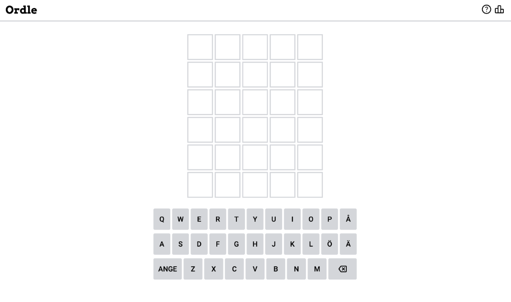
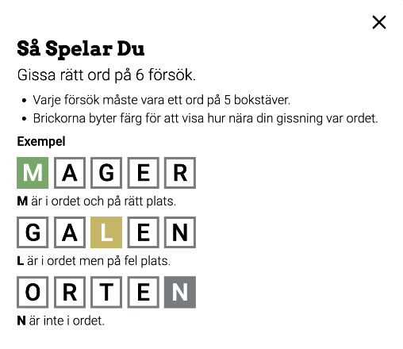
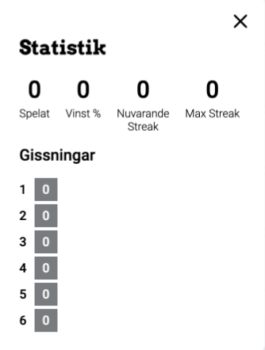
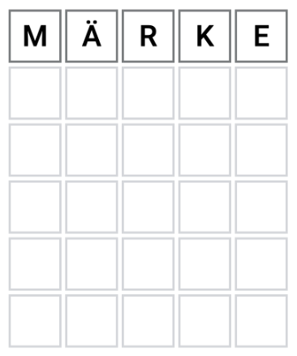
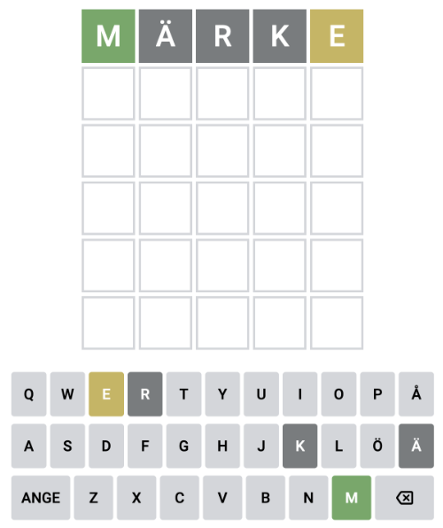
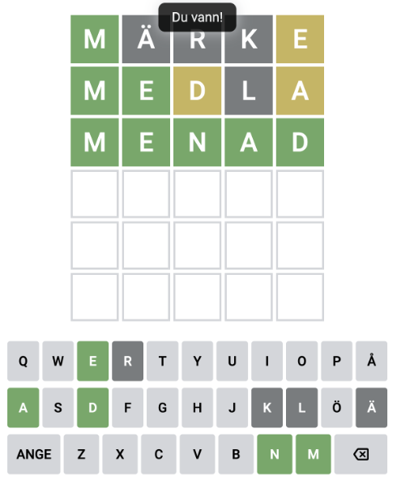
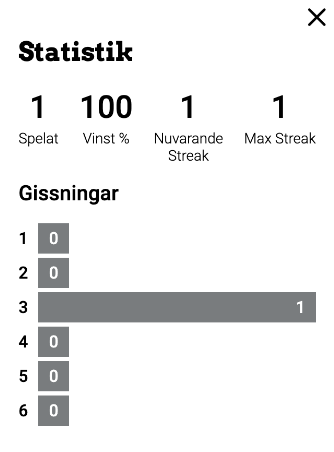
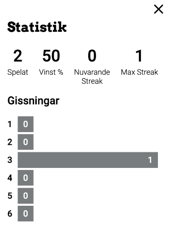

# Ordle

För min gesäll uppgift har jag försökt återskapa en svensk version av Wordle. Wordle är ett spel där användaren får gissa på ett slumpmässigt ord på fem bokstäver. Användaren har sex gissningar och får ledtrådar efter varje gissning. Ledtrådarna är färgkodade och färgen:

- Grå innebär att bokstaven inte är med i ordet
- Gul innebär att bokstaven är med i ordet men på fel plats
- Grön innebär att bokstaven är med i ordet och på rätt plats.

Gissar användaren på rätt ord vinner användaren spelet och lyckas användaren inte gissa rätt inom sex gissningar avslutas spelet och användaren får reda på vilket ord det var. Användaren kan antingen använda tangentbordet på enheten eller det virtuella i webbläsaren för att skriva in sina gissningar. Navigationen har en hjälp-knapp och en statistik-knapp. Båda öppnar dialogrutor skapade genom _jQuery UI_ där stilen är förändrat från default.

## Dialogrutor

### Hjälp

 Hjälp-knappen öppnar en dialogruta som visar reglerna för spelet och illustrerar färgkodningen genom exempel.

### Statistik

 Statistik-knappen öppnar en dialogruta som använder _localStorage_ för att lagra statistik kring användarens spelande. Datan som lagras är antal spelade spel, spel som användaren vunnit (i procent), hur många spel på rad som användaren vunnit, hur många spel på rad som användaren vunnit någonsin. Under visas även en graf av hur många gissningar det tagit användaren att gissa rätt ord.

## Spelet

När webbsidan laddar initialiseras spelet. Ett slumpmässigt ord väljs från arrayen med möjliga ord, statistik hämtas från localStorage och uppdaterar objektet _statsData_ och dialogrutorna skapas. För att utföra en gissning matar användaren in ett ord på fem bokstäver. När användaren klickar på tangentbordet hanterat en _EventListener_ som hanterar tangenten och fyller rutan med koden. När en ruta fylls förändras färgen på border för att tydliggöra detta. Användaren kan radera inmatade bokstäver och ange sin gissning när ordet är fem bokstäver långt.

Inmatat ord
När användaren anger ordet så jämför programmet det inmatade ordet mot det korrekta ordet. Rutorna kommer nu att uppdateras med ledtråden för användaren och byter till nästa rad ifall ordet inte är rätt. Det virtuella tangentbordet uppdateras också för att reflektera ledtråden. I bilden är alltså bokstaven **M** på rätt plats, **ÄRK** finns inte i ordet och **E** är på fel plats. Användaren kan nu påbörja nästa gissning.

Användaren kan fortsätta gissa tills dess att användaren antingen gissat rätt eller använt sina sex gissningar. När användaren gissat rätt eller förlorat, visas ett meddelande med texten _Du vann!_ eller _Rätt ord: “ORDET”_. I bilden har användaren gissat rätt på tredje försöket.

Nu kan användaren se den uppdaterade statistiken i statistik-rutan som är uppdaterad med datan som lagras i _localStorage_.

Skulle användaren gissa fel så visas det korrekta ordet. Statistiken uppdateras men ingen ny gissning registreras då användaren inte gissade rätt ord.

## Sammanfattning

Sammanfattningsvis är jag nöjd med programmet. Jag fick idén och började fundera hur logiken i Wordle fungerade. Jag bildade mig en uppfattning och så började jag bygga logiken. En del anpassningar gjordes och jag försökte använda det jag lärt mig i tidigare programmeringskurser såsom PROG1 och UDPR som uppdelning av metoder och dylikt. En del kod är nog inte så städad som den kunde vara men det funkade och att jag lyckades få ihop det är jag nöjd med. Just nu kan programmet inte avgöra om en bokstav redan är bedömd i ledtråden eller inte och kommer markera den igen. Exempelvis om du bara skriver bokstaven **M** för ordet **MÄRKE** kommer första rutan bli grön och resterande gula. Det gör att ledtråden inte fungerar för ord med två av samma bokstav och därför finns det inte några sådana i den slumpmässiga listan. Programmet kan heller inte kontrollera att det angivna ordet faktiskt är ett ord, som Wordle gör. Det gör att användaren kan skriva in vad de vill och få ledtrådar som kan leda till det rätta ordet. Vid mer tid och förståelse för serversidan hade jag velat kontrollera ordet från servern istället för att slumpmässigt välja ett ord från en lista som är synlig för användaren om den anger _correctWord_ i konsolen.
